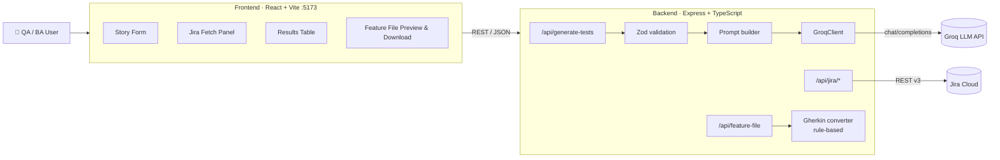
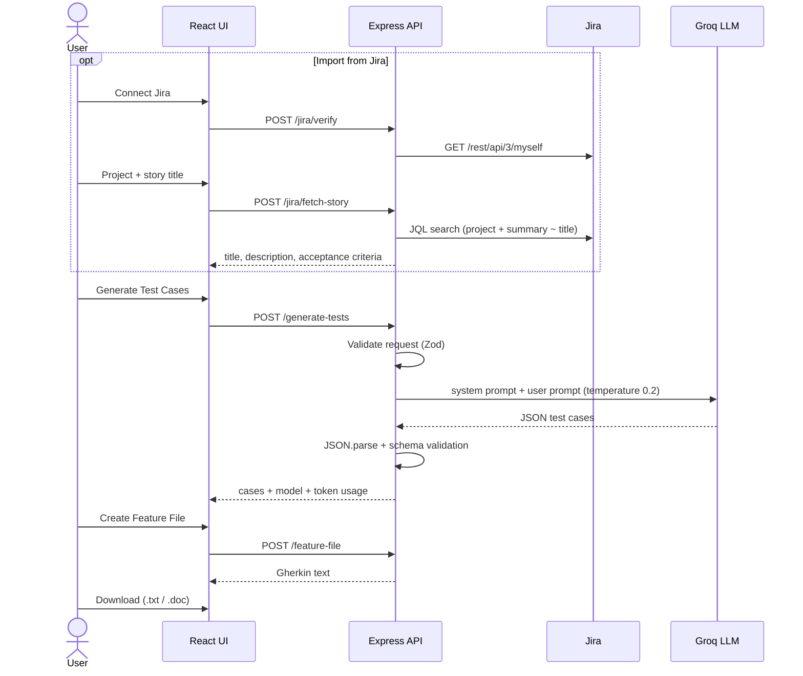

# Jira Story → AI Test Case & Feature Generator

> Turn user stories and acceptance criteria into structured QA test cases — and then into Gherkin `.feature` files — using an LLM.

---

## Table of Contents

1. [🎯 What is this?](#-what-is-this)
2. [✨ Key Features](#-key-features)
3. [🏗️ Architecture](#️-architecture)
4. [🔄 How it works](#-how-it-works)
5. [🤖 Where GenAI is used](#-where-genai-is-used)
6. [🧪 Test Case Generation](#-test-case-generation)
7. [📊 Example](#-example)
8. [📤 Export Options](#-export-options)
9. [🛠️ Tech Stack](#️-tech-stack)
10. [🚀 Getting Started](#-getting-started)
11. [📁 Project Structure](#-project-structure)
12. [🔐 Security / LLM Safety](#-security--llm-safety)
13. [🔮 Future Enhancements](#-future-enhancements)

---

## 🎯 What is this?

Writing test cases from user stories is slow, repetitive work, and edge cases are easy to miss. This full-stack app speeds that up:

- You paste a user story, or **fetch one directly from Jira**.
- An LLM (served through **Groq**) acts as a senior QA engineer and produces **positive, negative, edge, authorization and non-functional** test cases.
- The results appear in an interactive table and can be converted into a **Gherkin feature file** (`Given / When / Then`) that is ready for BDD automation with tools like Cucumber or Playwright.

---

## ✨ Key Features

| Feature | Description |
|---|---|
| 📝 **Story input form** | Story title, description, acceptance criteria and additional information |
| 🔗 **Jira integration** | Verify Jira credentials and fetch a story by project name and summary, including its description and *Acceptance Criteria* custom field |
| 🤖 **AI test generation** | The LLM returns structured test cases with IDs (`TC-001`…), steps, test data, expected results and a category |
| 🛡️ **Schema-validated output** | Every LLM response is parsed and checked against a **Zod** schema before it reaches the UI |
| 🔍 **Expandable results table** | Click a test case ID to see its step-by-step breakdown (`S01`, `S02`, …) |
| 🥒 **Gherkin feature file builder** | Converts test cases into `Feature` / `Scenario` / `Scenario Outline` with `Examples` tables |
| 📥 **Download** | Save the feature file as `.txt` or `.doc` |
| 📊 **Usage metadata** | Shows the model used and the total tokens consumed per generation |

---

## 🏗️ Architecture



The app is an **npm workspaces monorepo** with two packages:

- **`frontend/`**: a single-page React app with the form, Jira panel, results table and feature file preview.
- **`backend/`**: an Express API that validates input, builds prompts, calls the LLM, talks to Jira and builds Gherkin files.

### API endpoints

| Method | Endpoint | Purpose |
|---|---|---|
| `GET` | `/api/health` | Health check |
| `POST` | `/api/generate-tests` | Generate test cases from a user story (LLM) |
| `POST` | `/api/feature-file` | Convert test cases into Gherkin feature file text |
| `POST` | `/api/jira/verify` | Verify the Jira credentials configured in `.env` |
| `POST` | `/api/jira/fetch-story` | Fetch one story by project name and summary |
| `POST` | `/api/jira/connect` | List up to 50 stories from a Jira project |

---

## 🔄 How it works



1. **Input.** Enter the story manually, or import it from Jira. Jira's rich-text (ADF) description is flattened to plain text, and the *Acceptance Criteria* custom field is detected automatically.
2. **Generate.** The backend builds a prompt and calls the Groq chat completions API.
3. **Validate.** The response must be valid JSON that matches `GenerateResponseSchema`. Otherwise the API returns `502` with a clear error.
4. **Review.** Test cases are shown in a table that can be expanded to show each step.
5. **Convert & export.** A rule-based converter turns the steps into Gherkin, and you can download the result.

---

## 🤖 Where GenAI is used

GenAI is used in **exactly one place**, the test case generation step. Everything else is deterministic code.

| Stage | GenAI? | Implementation |
|---|---|---|
| Jira fetch & parsing | ❌ | REST API + JQL + ADF text extraction |
| Test case generation | ✅ | Groq LLM, see [backend/src/llm/groqClient.ts](backend/src/llm/groqClient.ts) |
| Output validation | ❌ | Zod schemas, see [backend/src/schemas.ts](backend/src/schemas.ts) |
| Gherkin conversion | ❌ | Regex/keyword classifier, see [backend/src/routes/feature.ts](backend/src/routes/feature.ts) |

**LLM configuration**

- **Provider:** Groq (OpenAI-compatible `/chat/completions` endpoint)
- **Model:** configurable through `groq_MODEL`, for example `openai/gpt-oss-120b`. The fallback is `llama3-8b-8192`.
- **Temperature:** `0.2`, which keeps output consistent and structured
- **Prompting:** a **system prompt** assigns the *senior QA engineer* role and a strict JSON schema, and a **user prompt** is built dynamically from the story fields. See [backend/src/prompt.ts](backend/src/prompt.ts).

There is also a GitHub Copilot custom agent at [.github/agents/gherkin-conversion.agent.md](.github/agents/gherkin-conversion.agent.md). You can use it in the IDE to refine feature files into production-ready BDD style.

---

## 🧪 Test Case Generation

The LLM is instructed to return **only** JSON in this shape:

```json
{
  "cases": [
    {
      "id": "TC-001",
      "title": "string",
      "steps": ["string"],
      "testData": "string (optional)",
      "expectedResult": "string",
      "category": "Positive | Negative | Edge | Authorization | Non-Functional"
    }
  ],
  "model": "string",
  "promptTokens": 0,
  "completionTokens": 0
}
```

**Coverage categories**

| Category | What it tests |
|---|---|
| ✅ Positive | Happy path, valid inputs |
| ❌ Negative | Invalid inputs, error handling |
| 🔀 Edge | Boundary values, unusual but valid situations |
| 🔒 Authorization | Roles, permissions, access control |
| ⚡ Non-Functional | Performance, usability, security, and similar concerns |

**Gherkin conversion rules** (`/api/feature-file`)

- Each step is normalised: question marks, trailing punctuation and question-style openings such as *"Does the system…"* are removed.
- Each step is classified as a **precondition → `Given`**, an **action → `When`**, or a **validation → `Then`**. Repeated keywords become `And`.
- Quoted values in steps (for example `"user@test.com"`) become `<Placeholders>`, and the scenario becomes a **`Scenario Outline`** with an `Examples` table.
- Acceptance criteria are kept as comments under the `Feature`.

---

## 📊 Example

**Input**

```text
Story Title:          User Login
Acceptance Criteria:  - User can log in with a valid email and password
                      - An error is shown for invalid credentials
                      - The account locks after 5 failed attempts
```

**Generated test cases** (excerpt)

| ID | Title | Category | Expected Result |
|---|---|---|---|
| TC-001 | Login with valid credentials | Positive | User is redirected to the dashboard |
| TC-002 | Login with wrong password | Negative | "Invalid credentials" error is displayed |
| TC-003 | Account lock after 5 failed attempts | Edge | Account is locked and a message is shown |
| TC-004 | Access dashboard without login | Authorization | User is redirected to the login page |

**Generated feature file** (excerpt)

```gherkin
Feature: User Login

  # Acceptance Criteria
  # - User can log in with a valid email and password
  # - An error is shown for invalid credentials
  # - The account locks after 5 failed attempts

Scenario Outline: Login with valid credentials
  Given the user is on the login page
  When the user enters email "<Email>"
  And the user enters password "<Password>"
  And the user clicks the login button
  Then the dashboard is displayed

  Examples:
    | Email | Password |
    | user@test.com | Passw0rd! |
```

> The exact output depends on the model and your story. Always review generated tests before you use them.

---

## 📤 Export Options

| Format | How |
|---|---|
| 🥒 **Gherkin feature file (`.txt`)** | Click **Create Feature File**, choose `txt`, then click **Download Feature File** |
| 📄 **Word-compatible (`.doc`)** | Same flow, with `doc` selected |
| 🧾 **Raw JSON** | Call `POST /api/generate-tests` directly (for example from Postman or a CI script) |

Downloaded files are named after the story title, for example `User_Login.txt`. Rename them to `.feature` to use them in Cucumber or Playwright-BDD projects.

---

## 🛠️ Tech Stack

| Layer | Technology |
|---|---|
| Frontend | React 18, TypeScript, Vite 5 |
| Backend | Node.js, Express 4, TypeScript, `tsx` (dev watch) |
| Validation | Zod |
| LLM | Groq API (OpenAI-compatible), configurable model |
| Integrations | Jira Cloud REST API v3 (Basic auth with an API token) |
| Tooling | npm workspaces, `concurrently`, `dotenv` |

---

## 🚀 Getting Started

### Prerequisites

- **Node.js 18+**, which provides the built-in `fetch` the backend uses
- A **Groq API key** from <https://console.groq.com>
- *(Optional)* A Jira Cloud account and an **API token** from <https://id.atlassian.com/manage-profile/security/api-tokens>

### 1. Install

```bash
git clone <your-repo-url>
cd user-story-to-tests
npm install          # installs root + frontend + backend workspaces
```

### 2. Configure environment

Create **`.env`** in the project root:

```env
PORT=8090
CORS_ORIGIN=http://localhost:5173

groq_API_BASE=https://api.groq.com/openai/v1
groq_API_KEY=your_groq_api_key
groq_MODEL=openai/gpt-oss-120b

# Jira Configuration (optional)
JIRA_BASE_URL=https://your-domain.atlassian.net
JIRA_EMAIL=you@example.com
JIRA_API_KEY=your_jira_api_token
```

Create **`frontend/.env`**:

```env
# Must match PORT in the root .env
VITE_API_BASE_URL=http://localhost:8090/api
```

### 3. Run

```bash
npm run dev          # starts backend + frontend together
```

- Frontend: <http://localhost:5173>
- Backend: <http://localhost:8090/api>
- Health check: <http://localhost:8090/api/health>

### Other scripts

```bash
npm run typecheck                        # type-check both workspaces
npm run build --workspace=backend        # compile backend to dist/
npm run start --workspace=backend        # run compiled backend
npm run build --workspace=frontend       # production build of the UI
```

---

## 📁 Project Structure

```text
user-story-to-tests/
├── .env                          # Backend secrets & config (git-ignored)
├── package.json                  # Workspaces + `npm run dev`
├── .github/
│   └── agents/
│       └── gherkin-conversion.agent.md   # Copilot agent for BDD refinement
├── backend/
│   ├── package.json
│   ├── tsconfig.json
│   └── src/
│       ├── server.ts             # Express app, CORS, routes, error handling
│       ├── prompt.ts             # System prompt + user prompt builder
│       ├── schemas.ts            # Zod request/response schemas & types
│       ├── llm/
│       │   └── groqClient.ts     # Groq chat-completions client
│       └── routes/
│           ├── generate.ts       # POST /api/generate-tests
│           ├── feature.ts        # POST /api/feature-file (Gherkin builder)
│           └── jira.ts           # /api/jira/verify | connect | fetch-story
└── frontend/
    ├── .env                      # VITE_API_BASE_URL
    ├── index.html
    ├── vite.config.ts
    └── src/
        ├── main.tsx
        ├── App.tsx               # UI: form, Jira panel, results, export
        ├── api.ts                # Fetch wrappers for backend endpoints
        └── types.ts              # Shared TS interfaces
```

---

## 🔐 Security / LLM Safety

**What is in place**

- 🔑 **Secrets stay server-side.** The Groq and Jira keys are read from `.env` on the backend only, and `.env` files are git-ignored.
- ✅ **Input validation.** All request bodies are validated with Zod before any processing.
- 🧱 **Output validation.** LLM output must be valid JSON and must match the expected schema. Malformed or off-schema responses are rejected with `502` and never reach the UI.
- 🎯 **Constrained prompting.** The system prompt fixes the role and the output format, and the low temperature (`0.2`) reduces random or hallucinated output.
- 🌐 **CORS** is restricted to `CORS_ORIGIN`.
- 🙈 **Production error masking.** When `NODE_ENV=production`, internal error details are hidden from clients.
- 🧮 **JQL escaping.** Quotes in project and story names are escaped before they are inserted into JQL queries.

**Known limitations / recommendations**

- ⚠️ **Prompt injection.** Story text is inserted directly into the prompt. A malicious story could try to override the instructions. Schema validation limits the damage, but you should still review output.
- ⚠️ **Verbose logging.** The backend logs full LLM requests and responses and a partially masked API key. Turn this down before any shared or production deployment.
- ⚠️ **No authentication or rate limiting** on the API. Add both before you expose it beyond localhost.
- ⚠️ `/api/jira/connect` accepts Jira credentials in the request body. Use it only over HTTPS.
- 🧑‍🔬 **Human in the loop.** Generated tests are suggestions. A QA engineer should always review them for correctness and coverage.
- 🔏 **Data privacy.** Story content is sent to a third-party LLM provider. Do not submit confidential data unless your organisation's policy allows it.

---

## 🔮 Future Enhancements

- [ ] 📑 Export to **CSV / Excel** and native **`.feature`** extension
- [ ] 🔁 **Push test cases back to Jira** (Xray / Zephyr) or TestRail
- [ ] 🧩 **Select a story from a list** in the UI (the `/api/jira/connect` endpoint already exists)
- [ ] 🧠 **Multi-provider LLM support** (Claude, OpenAI, Azure OpenAI, local models) with a model picker
- [ ] 🤖 Generate **automation code** (Playwright / Cypress step definitions) from feature files
- [ ] 🌐 **API test generation** from OpenAPI / Swagger specs and Postman collections
- [ ] ✏️ **Inline editing** and regeneration of individual test cases
- [ ] 🔁 **Automatic retry / self-repair** when the LLM returns invalid JSON
- [ ] 🧪 Unit and integration tests for the backend and the Gherkin converter
- [ ] 🔐 Authentication, rate limiting and structured, redacted logging
- [ ] 🐳 **Docker** setup and CI/CD pipeline
